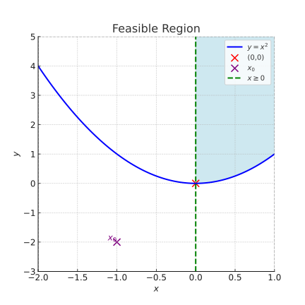

# ConstrainedSimplexSearch.jl

This repository contains the implementation of the Constrained Simplex Search algorithm
which is generalized from the unconstrained Nelder-Mead search method.
The algorithm is designed to solve optimization problems with constraints.

$$
\begin{align}
& \min_{x \in \mathbb{R}^N} f(x) \\
\text{s.t. }& g_i(x) \leq 0, i = 1,\dots,P \\
& h_j(x) = 0, j = 1,\dots,Q \\
& \text{lb}_k \leq x_k \leq \text{ub}_k, k = 1,\dots, N
\end{align}
$$

where
- $\text{lb}_k$ and $\text{ub}_k$ define a box/rectangular space which is the _feasible space_ of $x$,
where $(g,h)$ must be well-defined everywhere, which means no NaN or $\pm$ Inf are allowed in the returns.
- $(g,h)$ functions further characterize the _admissible space_ within the box feasible space. The admissible space is a subset of the feasible space.
- The objective function $f(x)$ is only required to be well-defined in the admissible space, which means that the returned value has physical meanings in the admissible space. However, due to technical reason of doing reflections, the objective function should still return a (large enough or Inf) real non-NaN value in the feasible but non-admissible space.


## Features

- Implements the Constrained Simplex Search algorithm
- Strictly bounds the searching within a bounded box/rectangular feasible space
- Handles generic non-linear constraints using penalty which guides the simplex to move towards the admissible space
- Can reach exact boundary points but not arbitrarily approaching it

## Installation

To install the required dependencies, run:

```bash
pkg> add ConstrainedSimplexSearch # not registered in the Registry yet

# or directly install from GitHub
pkg> add "https://github.com/Clpr/ConstrainedSimplexSearch.jl.git#main"
```

## Usage

To use the Constrained Simplex Search algorithm, import the necessary modules and call the functions as demonstrated below:

$$
\begin{aligned}
& \min_{x,y} x^2 + y^2 \\
\text{s.t. }& x \geq 0 \\
& y \geq x^2 \\
& -2 \leq x \leq 1 \\
& -3 \leq y \leq 5
\end{aligned}
$$

which has a known corner solution $(0,0)$.




```julia
import ConstrainedSimplexSearch as css


# Define a box/rectangular feasible space
lb = [-2.0, -3.0]
ub = [ 1.0,  5.0]

# a convenience function to check if a point is in or on the box space
inbox(x ; lb = lb, ub = ub) = all(lb .<= x .<= ub)

# Inequality constraint g(x): receives an N-vector, returns a P-scalar
function g(x::AbstractVector)
    # for illustrative purpose, this function is undefined outside the box
    if inbox(x)
        return [
            - x[1]       , # x >= 0
            x[1]^2 - x[2], # y >= x^2
        ]
    else
        return [
            NaN,
            NaN,
        ]
    end
end

# Equality constraint h(x): receives an N-vector, returns a Q-vector
function h(x::AbstractVector)
    return []
end


# Objective function: receives an N-vector and returns a scalar
# for illustrative purpose, the function is only well-defined in the admissible space
# but can return a large value in the feasible but non-admissible space
function f(x::AbstractVector)
    flag_admis = all(g(x) .<= 0.0) & all(abs.(h(x)) .< 1E-3)
	if inbox(x)
    	if flag_admis
			return sum(x .^ 2)
        else
            # returns arbitrary value in the feasible but non-admissible space
        	return 114514.0
        end
    else
        # undefined outside the box
    	return NaN
    end
end


# Define the minimization problem
mp = css.MinimizeProblem(
    f, g, h,
    2, 2, 0, # (N,P,Q), report the dimensionalities of the problem
    lb = lb,
    ub = ub,
)

# Run the algorithm
@time res = css.solve(
    mp,
    x0 = [-1, -2], # within-box point to initialize the simplex

    verbose = true, # if to print the iteration details
    showevery = 1, # every how many iterations to print if verbose == true

    maxiter = 1000, # max iteration

    δ    = 1E-4, # tolerance for the equality constraint violation
    R    = 2.0 , # penalty factor for the equality constraint violation
    
    α    = 1.0,  # reflection factor, (0,∞)
    γ    = 1.5,  # expansion factor, (1,∞)
    ρout = 0.4,  # outside contraction factor, (0,0.5]
    ρin  = 0.4,  # inside contraction factor, (0,0.5]
    σ    = 0.5,  # shrink factor, (0,1)

    ftol = 1E-5, # tol for the function value gap at vertexes
    xtol = 1E-5, # tol for the max simplex edge length/size
)

# what are included in the result (a named tuple)
res.x ::SVector{N,Float64}     # the searched optimal point
res.f ::Float64                # the objective function value
res.converged::Bool            # if the algorithm converged
res.admissible::Bool           # if the returned result is admissible
```

Users can test other initial points including some special points:
- $(-2.0,-3.0)$: bottom left corner
- $(1.0,5.0)$: top right corner
- $(0.0,0.0)$: the true solution

**Notes**
1. The keyword argument `x0::AbstractVector=` specifies a point where the simplex is initialized. Such as point must be interior regarding the box constraints `[lb,ub]`, but not necessary to satisfy the inequality constraint $g(x)$ and equality constraints $h(x)$.
    - By default, the center point of the box space (say `(lb + ub)/2`) is applied. One may call `css.boxcenter(mp)` to do this job
    - In the above example, the illustrative `x0` $(-1,-2)$ is within the box $[-2,1]\times [-3,5]$, but does not satisfy the inequality constraints
2. Detailed docstrings are availble by using `?function_name`.
3. Fine tuning is necessary for quick convergence. Try different strategies regarding your problems.


## Pros & Cons

**Pros**
- As robust as Nelder-Mead
- Can handle box constraints and inequality constraints effectively
- Works with high-dimensional approximations (e.g. sparse grid interpolations)
in which the derivatives are oscilliating or unstable across the space
- Very useful in quantitative macroeconomic modeling, esp. working with intra-period portfolio optimization problems.

**Cons**
- Can handle equality constraints but very **_not_** recommended. In general, the simplex-based methods do not work well with equality constraints which in fact "reduce" the dimensionality of the searching space. Please consider substituting out the equality constraints by re-defining the control variables.
- Less efficient if the function evaluations are expensive


## Reference

- Mehta, Vivek Kumar, and Bhaskar Dasgupta. "A constrained optimization algorithm based on the simplex search method." _Engineering Optimization_ 44, no. 5 (2012): 537-550.

- Nealder-Mead implementation: `https://alexdowad.github.io/visualizing-nelder-mead/`


## License

MIT license


## Example: Collateral constraint

Consider the following household problem who enjoys consumption $c$ and housing wealth $h$:

$$
v(b,h,p) = \max_{c,b',h'} \frac{[c^\alpha h^\alpha]^{1-\gamma}}{1-\gamma} + \beta \mathbb{E}\{ v(b',h',p') \} \\
~\\
c + p h' + (1+r)b' = b + h^\alpha + ph \\
c \geq 0, h' \geq 0 \\
b' \leq \theta p h' \\
~\\
p \sim Uniform[0.5,1.5] \\
b,h \in [\underline{b},\bar{b}]\times [\underline{h},\bar{h}]
$$

In this simplified problem, due to the stochasticity of housing price $p$,
the admissible space of $(c,b',h')$ is state-dependent. A conventional method 
to handle this problem is endogeneous grid, which converts the state space to the 
total value of the housing wealth.
However, this is less intuitive in computation and often fails if there is non-linearity
in the constraint (e.g. a threshold options to sell the house).

And, if we use classic gradient-based solvers such as interior point methods,
then it is unavoidable that many solvers would try evaluating the Laganrian
in the non-admissible space. There are two issues:
1. The gradient/Hessian approximation in the neighborhood of the admissible boundary
is severely biased, even if we force the returned values to be a
very negative values (e.g. $1.919810\times 10^{20}$)
2. The solver cannot exactly stop at the boundary where $b'=\theta p h'$ exactly, while
this exact bindingness may fall in our interests (e.g. checking the behvaior of the binding borrowers)

In this case, the constrained simplex method implemented in this package works well.


