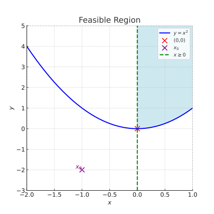

# ConstrainedSimplexSearch.jl

`ConstrainedSimplexSearch.jl` is a lightweight, gradient-free constrained
simplex solver for box-bounded problems with arbitrary nonlinear inequality
constraints. Its central safety feature is that the objective function is
evaluated only at admissible points, making the package useful when an objective
has no meaningful value outside the economically or physically valid region.
The package solves problems of the form

```math
\begin{aligned}
& \min_{c \in \mathbb{R}^N} f(c) \\
\text{s.t. }&
\ell_k \leq c_k \leq u_k,\quad k = 1,\dots,N, \\
& g_i(c) \leq 0,\quad i = 1,\dots,P.
\end{aligned}
```

Here, $c$ is the control vector, $f(c)$ is the scalar objective, $g(c)$ is
the vector of inequality constraints, and $[\ell,u]$ is the feasible box
domain. More precisely,

```math
\mathcal{B} = \{c \in \mathbb{R}^N : \ell \leq c \leq u\}
```

is the **feasible box domain**, while

```math
\mathcal{A} = \{c \in \mathcal{B} : g_i(c) \leq 0,\ i = 1,\dots,P\}
```

is the **admissible set**. The constraint function $g(c)$ must be defined and
finite throughout $\mathcal{B}$, but the objective $f(c)$ only needs to be
defined on $\mathcal{A}$. Simplex moves are clipped into the box, constraints
are checked first, and the objective is called only when the candidate belongs
to the admissible set.

## Motivation

Economic models often solve stochastic dynamic programming problems by solving
many disposable static optimization problems. Those subproblems may have
non-convex or even non-continuous admissible sets, unavailable or unreliable
gradients, and local glitches in the objective caused by approximation error.
These features motivate a lightweight, robust, gradient-free solver that can
work with arbitrary nonlinear constraints. In many applications, constraints
can be checked at every point in the feasible box even though the objective is
not defined at feasible but non-admissible points. Assigning an arbitrary bottom
or penalty value is unreliable: for example, an exponential-utility
specification can drive a computed value toward `-Inf` as a relevant state
approaches zero, crossing any finite bottom value selected in advance. The
numerical method must therefore avoid evaluating the objective at
non-admissible trial points. Barrier and penalty workflows that may internally
test such objective values are unsuitable for this callback contract, while a
Nelder-Mead/simplex-style search with constraint-first evaluation can make it.

## Usage

Install the registered package from the Julia package prompt:

```julia
pkg> add ConstrainedSimplexSearch
```

To install the repository version directly, use:

```julia
pkg> add "https://github.com/Clpr/ConstrainedSimplexSearch.jl.git"
```

Import the package (with an explicit alias so package-owned names remain clear for illustration purpose):

```julia
import ConstrainedSimplexSearch as csx
```

Define an objective returning one real scalar and an inequality callback
returning a vector of length `nconstraints`. Constraints are always written as
`g(c) <= 0`. Even for a one-dimensional problem, both callbacks receive a
one-element `Vector{Float64}`. Callbacks are evaluated one control vector at a
time; no vectorized interface is required.

```julia
function objective_function(c::AbstractVector)::Float64
    return c[1]^2 + c[2]^2
end

function inequality_constraints(c::AbstractVector)::Vector{Float64}
    return [
        -c[1],
        c[1]^2 - c[2],
    ]
end
```

The inequality callback must return finite values throughout the feasible box.
The objective only needs to be meaningful on the admissible set because the
solver checks constraints before every objective call.

Construct the problem by reporting the control and constraint dimensions,
supplying both callbacks, and defining finite lower and upper bounds:

```julia
lb_c = [-2.0, -3.0]
ub_c = [ 1.0,  5.0]

prob = csx.ConstrainedSimplexSearch(
    ncontrols = 2,
    nconstraints = 2,
    function_objective = objective_function,
    function_constraints = inequality_constraints,
    lower_bounds = lb_c,
    upper_bounds = ub_c,
)
```

Choose one of three initial-simplex strategies. Use `csx.CenteredSimplex` when
you have a reasonable starting point; `radius` is the fraction of the distance
to the selected box side, and `towards` may be `:upper` or `:lower`.

```julia
simplex0 = csx.CenteredSimplex(
    c0 = [0.25, 0.5],
    radius = 0.5,
    towards = :upper,
)
```

Use `csx.MaxVolumeSimplex` when there is no strong initial guess. It spans a
substantial fraction of the box and can reduce sensitivity to local roughness
early in the search.

```julia
simplex0 = csx.MaxVolumeSimplex(radius = 0.7)
```

Use `csx.ExplicitSimplex` for complete control. Its matrix must have shape
`(ncontrols + 1, ncontrols)`, with one vertex per row.

```julia
simplex0 = csx.ExplicitSimplex([
    0.0 0.0
    0.5 0.0
    0.0 0.5
])
```

Before any callback runs, the solver checks the simplex shape, finite values,
box bounds, and strictly nonzero volume.

Each problem begins with the following mutable hyperparameter dictionary:

```julia
prob.hyperparam == Dict{String,Float64}(
    "reflection_factor"          => 1.0,
    "expansion_factor"           => 1.5,
    "contraction_factor_outside" => 0.4,
    "contraction_factor_inside"  => 0.4,
    "shrink_factor"              => 0.5,
)
```

The factors control reflection away from the worst vertex, expansion beyond a
successful reflection, outside and inside contraction toward the centroid, and
whole-simplex shrinkage toward the best vertex. They may be modified directly:

```julia
prob.hyperparam["expansion_factor"] = 1.8
```

Run the native solver with:

```julia
result = csx.optimize(
    prob,
    simplex0;
    use_maximize = false,
    max_iteration = 1000,
    objective_tolerance = 1E-4,
    control_tolerance = 1E-4,
    verbose = false,
    showevery = 2,
    rich_returns = true,
    parallel_mode = :serial,
    max_workers = nothing,
)
```

`use_maximize` reverses objective ordering while preserving the objective value
in the result. `max_iteration` caps solver iterations. The two tolerances test
the simplex score spread and maximum edge length. `verbose` prints progress
every `showevery` iterations. `rich_returns` includes traces and diagnostics.
`parallel_mode = :serial` is the default and safest setting for most scientific
callbacks; `:thread` can evaluate current simplex vertices concurrently when
callbacks are expensive and thread-safe. In thread mode, `max_workers` can cap
the number of worker tasks; `nothing` uses Julia's configured thread pool.

The solver returns a `Dict{String,Any}`. Its required fields are:

```julia
result["optimal_control"]
result["optimal_objective"]
result["convergence_status"]
result["admissibility_status"]
result["exit_objective_error"]
result["exit_control_error"]
result["exit_iteration"]
```

Possible convergence statuses are `"converged_both"`,
`"converged_objective"`, `"converged_control"`,
`"reached_max_iteration"`, and `"not_converged"`. Admissibility is reported as
`"admissible"` or `"non_admissible"`. Numerical convergence does not itself
guarantee admissibility, so production code should inspect both statuses. Rich
returns also include `"objective_lower_bound_trace"`,
`"objective_upper_bound_trace"`, `"error_trace_objective"`,
`"error_trace_control"`, `"elapsed_walltime_seconds"`, and counters for
reflection, expansion, outside contraction, inside contraction, and shrink
moves.

The optional `Optim.jl` frontend wraps the same guarded solver without changing
the algorithm or callback safety rule:

```julia
pkg> add Optim
```

```julia
using Optim
import ConstrainedSimplexSearch as csx

options = Optim.Options(
    iterations = 1000,
    f_tol = 1E-6,
    x_tol = 1E-6,
    show_trace = true,
    show_every = 10,
)

result = csx.optimize(
    objective_function,
    lb_c,
    ub_c,
    csx.ConstrainedSimplex();
    inequality_constraints = inequality_constraints,
    initial_simplex = csx.MaxVolumeSimplex(radius = 0.7),
    options = options,
    maximize = false,
)

Optim.minimizer(result)
Optim.minimum(result)
Optim.converged(result)
Optim.iterations(result)
```

## Example

Consider the illustrative problem

```math
\begin{aligned}
& \min_{x,y} x^2 + y^2 \\
\text{s.t. }& x \geq 0, \\
& y \geq x^2, \\
& -2 \leq x \leq 1, \\
& -3 \leq y \leq 5.
\end{aligned}
```

Its known corner solution is ``(0,0)``.



```julia
import ConstrainedSimplexSearch as csx

function objective_function(c::AbstractVector)::Float64
    return c[1]^2 + c[2]^2
end

function inequality_constraints(c::AbstractVector)::Vector{Float64}
    return [
        -c[1],
        c[1]^2 - c[2],
    ]
end

lb_c = [-2.0, -3.0]
ub_c = [ 1.0,  5.0]

prob = csx.ConstrainedSimplexSearch(
    ncontrols = 2,
    nconstraints = 2,
    function_objective = objective_function,
    function_constraints = inequality_constraints,
    lower_bounds = lb_c,
    upper_bounds = ub_c,
)

simplex0 = csx.MaxVolumeSimplex(radius = 0.7)

result = csx.optimize(
    prob,
    simplex0;
    max_iteration = 1000,
    objective_tolerance = 1E-6,
    control_tolerance = 1E-6,
)

result["optimal_control"]
result["optimal_objective"]
result["convergence_status"]
result["admissibility_status"]
```

## Reference

- Mehta, Vivek Kumar, and Bhaskar Dasgupta. "A constrained optimization
  algorithm based on the simplex search method." _Engineering Optimization_
  44, no. 5 (2012): 537-550.

- Nelder-Mead implementation:
  `https://alexdowad.github.io/visualizing-nelder-mead/`

## License

This package is released under the MIT License.

## AI Usage Disclaimer

This package is developed and maintained by the author in person. AI coding
tools, including Codex, were used as assistants for selected development tasks
such as improving implementation performance, refactoring polish, and polishing
the README. The author personally reviewed the source code, tests, and
documentation, and remains responsible for the package behavior, maintenance,
and any issues.
